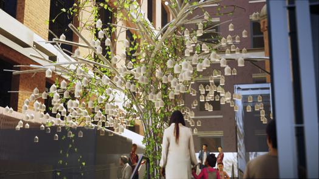

# conférence jade séguéla #
Premièrement, la présentation présentée par Jade Séguéla était vraiment intéressante.
Elle parlait des nombreuses difficultés de son travail et des défis qu’elle a dû 5 surmonté pendant les nombreuses installations et exposition. 
Elle nous aussi présenté sont boss Rafael Lozano-Hemmer et les nombreuses expositions qu’il a créées et qui a exposé à travers le monde comme la translation Stream. Une exposition qu'elle a eu l’honneur de travailleur dessus. Donc on a pu avoir un avis sur la production et les différentes épreuves qu’elle et son équipe ont du surmonté pendant la préparation de cette exposition. 
Troisièmement, voir la perspective de quelqu’un qui a pu travailler sur plusieurs expositions interactives à travers le monde. Voir le point de vue de cette personne et vraiment comprendre les difficultés de son travail, mais aussi ces responsabilités. Jade, qui travaille en production comme coordinateur. Donc Jade a pu voir l’évolution et la création de pleines de projets et d’expositions que Rafael a conçus. Mais elle a aussi la charge de faire voyager les installations et de s’assurer qu’elles sont en bon état et qui peut fonctionner quand il arrive dans le pays étranger.  
En gros elle supervise toutes les installations et s’occupe de leur bien fonctionnement. Pour finir, la conférence qu’on a eux avec Jade était intéressante et m’en a beaucoup appris sur son milieu de travail et les nombreuses œuvres et installations de Rafael.

source:https://www.lozano-hemmer.com/showimage_emb.php?proj=speaking_willow&img=washington_2020&idproj=337&type=artwork&id=1
