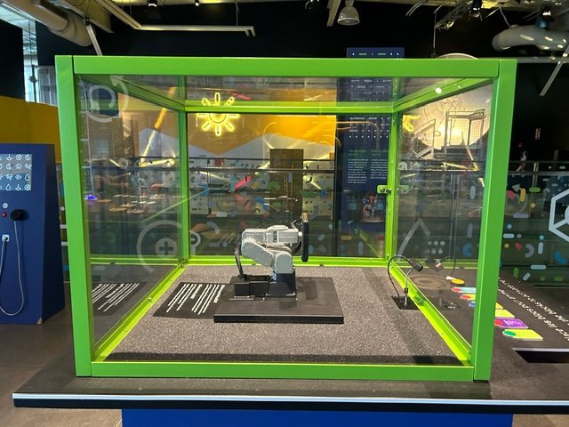
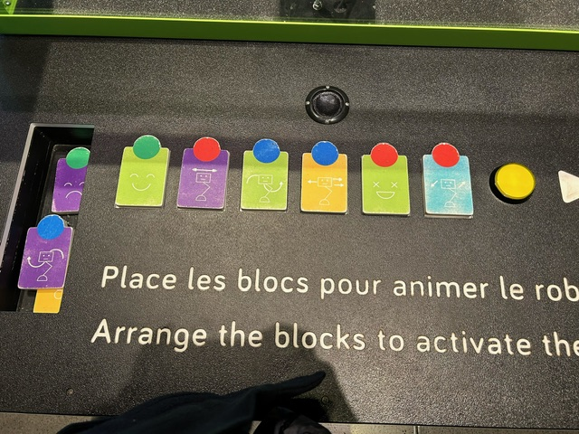
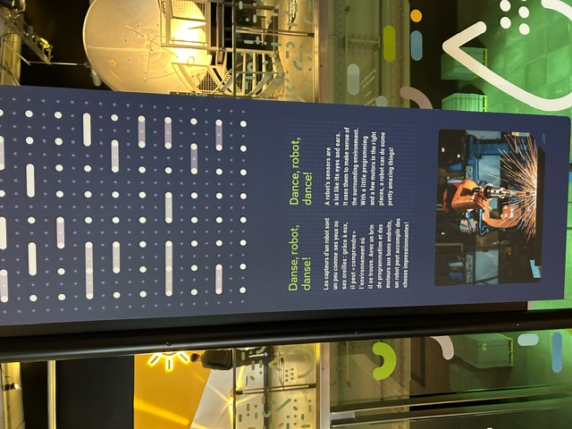
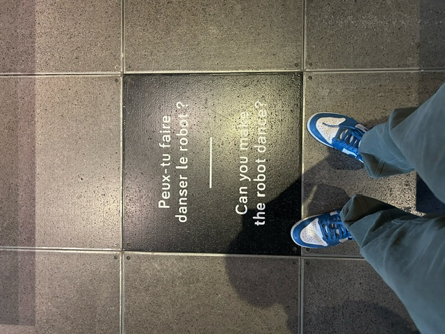
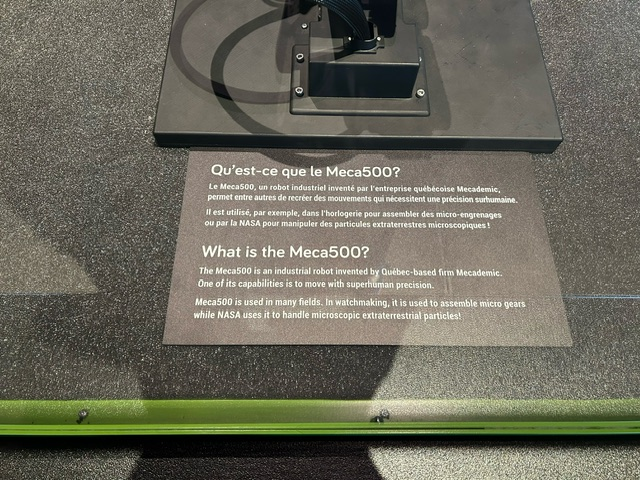
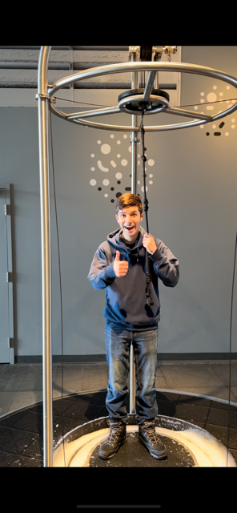

# dispositif multimédia du Centre des sciences  #
### bras robotique Meca500 ###

## introduction ##

J'aimerais partagé mes impressions de ma visite au ***centre des sciences***  le 5 avril 2024. Le Centre des sciences est un musée qui fait de la vulgarisation scientifique. Il y a des expositions permanentes et temporaires. J'ai choisi de présenter  une installation qui m'a vraiment intéressé.

## description de l'instalation ##

J' aimerais vous présenter le bras robotique *Meca500*.

    

voici *Meca500* un bras robotique inventé par l'entreprise québécoise Mecademic, basé à Montréal.Il a six axes (articulations) qui lui permettent de deplacer des objets. Ce petit bras (il est vraiment petit, on peut le mettre dans une valise! Cependant, malgré sa petite taille,  ce robot  fait  des mouvements qui sont très précis et qui sont normalement impossible pour l'être humain.En effet, la précision du robot est extraordinaire car sa possibilité d' erreur est plus petite que la taille d' un cheveu. Au musée, on peut faire danser le robot grâce à de la programmation: lorsque l' on appuie sur un bouton jaune, le robot exécute la directive qui est fourni par des cartes que l' on choisi.  

 

 

## description du dispositif multimedia ##

cette instalation du centre des science comporte plain d'aspect du multimedia par exemple. le fais d'utiliser plusieur pièce qui on probablement des carte magnétique qui vont envoyer un signale au petite ordinateur qui est probablement istaller a l'intérieure de la boite avec les robot. cette ordinateur qui va recevoir les différent signale et qui va dététerminer grâce a l'orde des différent carte et le signale que les différente carte envoyer a l'ordinateur. L'ordinateur va pouvoir nous dire c'est quoi l'orde et les  l'action qu'elle va faire. puis le visiteur va enfin pouvoir appuyer sur le bouton jaune et le robot va commencer a exécuté la petite corégraphie que vous avez programer avec l'aide des carte.

## expérience personnelle et conclusion ##

C' est un musée pour les groupes scolaire et les familles. Il y avait beaucoup de bruit, et quelque fois on avait de la difficulté à entendre les vidéos et les animations dans les expositions. J' ai bien aimé mon expérience et j' ai eu l'occasion d’en apprendre davantage sur la science.Ça m' a rappelé des souvenirs car je suis venu avec mon école loraque j' étais plus jeune. 
 
