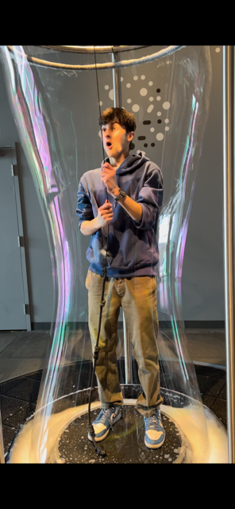

# dispositif multimedia du Centre des science  #
### bras robotique Meca500 ###

## introduction ##

voici mon experience au ***centre des science*** et les nombreuse instalation multimedia le 5 avril 2024. j'ai choisi une instalation a particullier qui ma vraiment intéraisser.

## description de l'instalation ##

pour ce projet j'ai décider de prendre le bras robotique *Meca500*.

    

voici *Meca500* un bras robotique industriel inventé par l'entreprise québécoise mecademic permet de recrée des mouvement qui sont normalement impossible pour l'être humain mais pour ce bras rien est impossible car elle peux recrée des movement avec une précission subhumaine. dans cette instalation tu pouvait faire dancer le vras robotique en utilisent différente carte qui donnais différente directive et action que le robot pouvait exécuter selon l'orde dans lequel tu les mettais. puis quand tu avais enfin décider de l'ordre des action de ton robot tu pesais sur le bouton jaune pour qu'il bouge.

 

 

## description du dispositif multimedia ##

cette instalation du centre des science comporte plain d'aspect du multimedia par exemple. le fais d'utiliser plusieur pièce qui on probablement des carte magnétique qui vont envoyer un signale au petite ordinateur qui est probablement istaller a l'intérieure de la boite avec les robot. cette ordinateur qui va recevoir les différent signale et qui va dététerminer grâce a l'orde des différent carte et le signale que les différente carte envoyer a l'ordinateur. L'ordinateur va pouvoir nous dire c'est quoi l'orde et les  l'action qu'elle va faire. puis le visiteur va enfin pouvoir appuyer sur le bouton jaune et le robot va commencer a exécuté la petite corégraphie que vous avez programer avec l'aide des carte.

## expérience personnelle et conclusion ##

pour conclure, j'aimerais rajoute que toute les instalation était vraiment intéraisente et que j'ai vraiment eux beaucoup de plaisir a venir au centre des science. même si je suis arriver en retard je pense pas que j'ai manqué grand chose. lesexposition permanente était vraiment amusente et on apporté beaucoup de plaisir et d'amusement a cette visite qui est une des plus intérécente. je dit pas que cétait la plus intérécente mais elle avait beaucoup de chose instructive et intérécente a voir et ma fait raplé beaucoup de souvenir d'enfance et de bonne mémoire je conseillerait cette expérience a tout le monde. 

 
