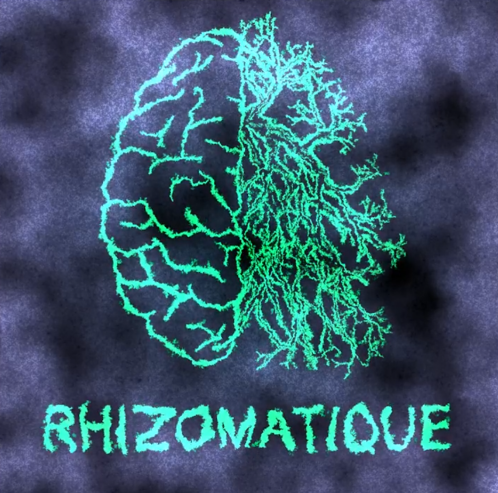
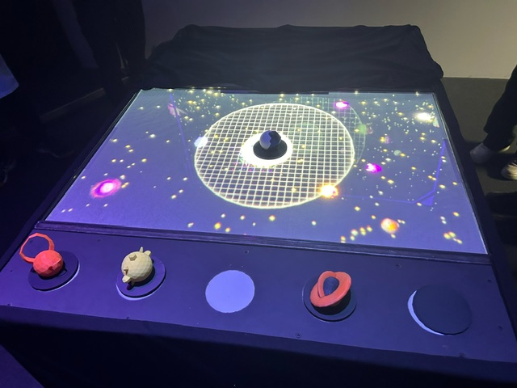
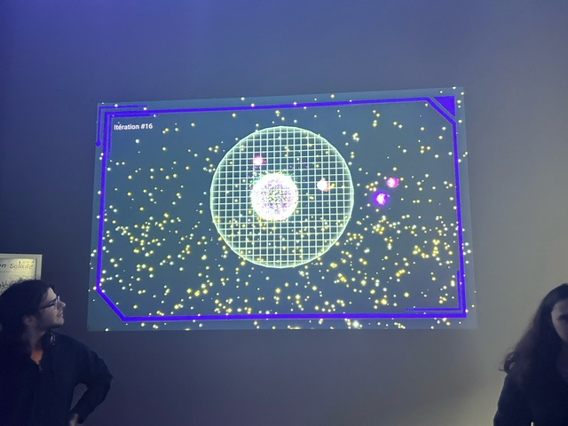
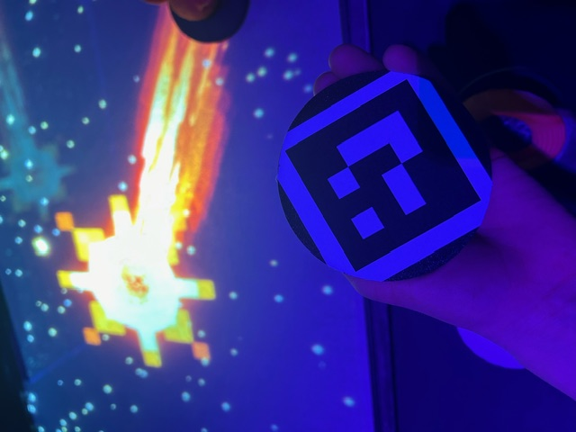
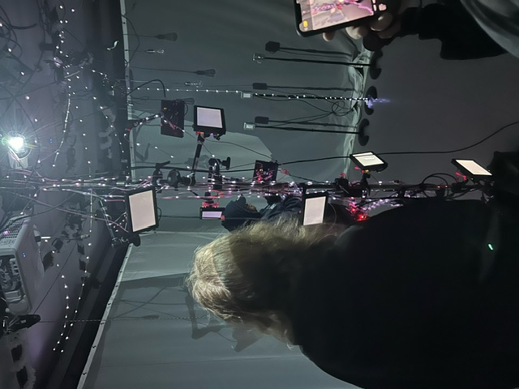
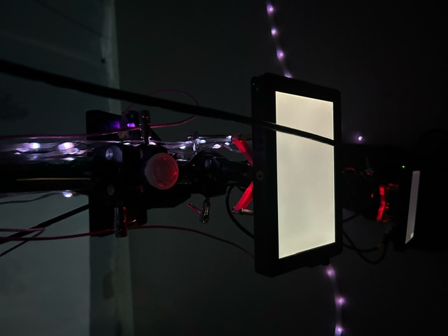
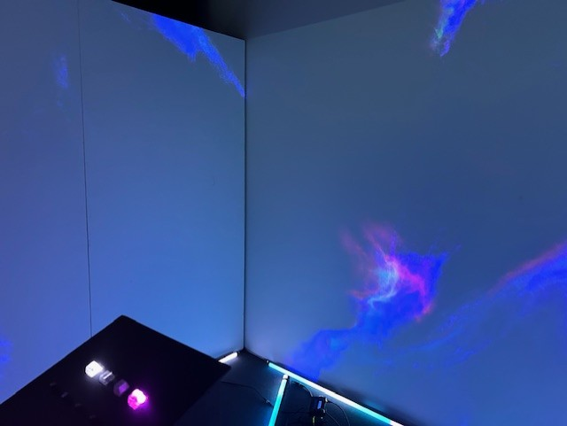

# Crescentia #
### Cégep Montmorency ###

J' aimerais partagé mes impressions de ma visite à  l'exposition ***Crescentia*** consacré au projet des finissants du programme de multimédia. Crescentia, est un mot en latin qui signifie croissance. 
*Dans cette exposition, il avait cinq projets différents qui ont mis le concept de l'évolution de l'avant.Je vais présenté chacun des projets. 

 

 
 
 

# Canevas Cosmique #

## Expérience proposé: ##

Je vais débuté par mon exposition préféré:  le canevas cosmique, elle était vraiment intéressante.C'est une simulation du système solaire en laboratoire.  Sur une table, il y a des petites statuettes et en les bougeant on crée des effets variés sur le canevas 
cosmique ce qui est vraiment intéressant. J' ai aussi aimé que l'on utilise des petites statues pour représenter chaque effet, cela aide beaucoup à l'immersion de l'installation. 

  

En plus d'avoir un écran qui montre la version de l'univer au complet en trois dimension un autre aspect qui aide a l'imersion. le canevas fonctionnet avec une *kinect*[^1] qui est cacher en dessous de la table et qui détecte les différent qr code qui son placé sur la table.On a aussi un tableau récapitulatif qui nous présente l' impact de nos mouvements avec les statuettes sur un écran. 

 

Un autre point positif de l' exposition est l' implication des gens. Ils sont les scientifiques du laboratoire Ils étaient présents pendant ma visite. J' ai eu la chance de discuter avec eux et d' en apprendre plus sur leur concept ainsi que les nombreuses idées qu' ils ont eu pendant le développement de leur projet. 
 
 
 

# Effet Papillon #

## L'expérience proposée: ##

L'exposition Effet Papillon démontre la conséquence de nos actions sur la croissance du pommier qui est la pièce centrale de cette exposition. Chaque action a un impact sur la croissance du pommier jusqu'à ce qu' il donne un pomme. Quand on entre dans la pièce, elle est sombre et il y a une lumière qui nous guide vers la première action à faire pour planter la graine en pesant sur un bouton. Par la suite, on fait des étapes en utilisant les petits écrans qui  montrent  plusieurs photos et qui changent selon les étapes que l' on fait et les stages du cycle de la vie. 

 

On a utilise des pôles pour batir la structure du pommier.L'équipe a utilisé les lumières LED pour simuler l' effet du soleil, En tant que participant on apprend que nos actions sont importantes pour le développement de notre cyber pommier.Les aspects visuels sont importantes des images nous guide lors des interractions et les conséquences qui arrivent suite à nos actions sont projettés sur les murs de la salle.La musique nous plonge dans un univers de la nature, il y avait plusieurs étapes de au niveau de la gestion des sons, l' ambiance et des sons quand on prenait une action ce qui amplifiait le son. Les lumières guidaient aussi l' endroit ou on devait interragir et les lumières on été utilisés pour créer des reliefs sur l' arbre.

 

Il y a deux étapes dans l' Effet papillon: lors de la première partie on interragi avec la structure pour la faire grandir. Dans la deuxième étape,on est ramené au début de notre expérience afin de revivre notre expérience sans interruption.Le visuel de la fin est le fun car on voit tout le cycle de vie. Ça devient une expérience éducative pour le participant.  

 
 
 
# Kigo #

## expérience proposé ##

Le jeu interractif  Kigo était vraiment intéressant. L'univers Kigo est un style néon rétro et le participant évolue dans differentes saisons. C' est un environnement Asiatique Le logo est diffusé en boucle en attendant qu' une personne débute le jeu. Lorsque le participant est détecté par la  *kinect*[^1] le jeu débute. Le joueur peut se déplacer dans une zone et on voit son avatar  grâce au projecteur. Plusieurs technologies sont utilisés: projection interractive, projecteurs, kinnect, plate forme d' interractions. Il y avait aussi des modélisations 3D et des sons qui accompagnait le parcours du joueur, les sons utilisés sont des sons qui proviennent des jeux vidéos. 

Comme dans un jeu vidéo, chaque participant a trois vie et doit accumuler des points. Quand la partie commence, le joueur doit eviter les obstacles en utilisant son corps.L' objectif est d' accumuler le plus de points À la fin il y a une scene de défaite quand le jeu est fini, il y a aussi une autre scène qunad on sort de la zone du jeu afin de nous ramener dans le jeu. Quand je suis allé, il y a avait un problème avec le Body traking des mouvements qui ne se transmettait pas bien à l'écran mais j' ai bien aimé mon expérience!  

# Rhizomatique #

## expérience proposé ##
Rhizomatique, c' est une oeuvre multimédia immersive qui fait le lien entre le temps et l' humain.
Le participant en pesant sur la toile déclenche ses souvenirs. La salle est composé d' une structure et de toiles projetté sur 3 murs. 
La toile represente le cerveau. Le participant pèse sur la toile et active ses souvenirs par la rhizomatique qui est le concept offert dans l' exposition. 
Plus tu pèses sur la toile plus ton souvenirs apparait et si tu pèses rapidememnt le souvenirs disparait. 

La lumière nous guide pour prendre notre place derrière la station de contrôle. Quand tu arrives tout va vite mais dès que tu actionnes le contr^le et que les souvenirs apparaissent tout se calme. Les images sur la toile sont très modernes, il y a des difference de couleur quns tu touche la toile 
Dans l' installation on utilise plusieurs projecteurs qui projetait des vidéos. L' environnement sonore était aussi intéressant, il y a plusieurs niveau de son, 
un son de fond qui est associé avec le souvenir qui est présenté et lorsque le participant déclenche un souvenir il y a 
un son qui s' ajoute pour créer l'effet lointain qui rappelle le souvenir qui est présenté

 

 L'exposition utilisait bien les fonctions de la *kinect*[^1]et l' aspect rapide et lent du souvenir qui apparait.Les projection sur le mur était bien fait
 ## EXPÉRIENCE PERSONELLE ##
Bien aimé le concept! On a l' impression d' explorer les souvenirs qui se trouve dans notre cerveau. C' est une exposition qui est très relaxante grâce à la musique et les images.Le nom rhizomatique était bizarre mais il fait référence aux racine des plantes. Dans l'oeuvre on fait beaucoup le lien entre le temps et l' humain c' est plus scientifique! Il y a beaucoup d' images de cellules et de neurones. Je ne suis pas certain d' aimé le nom mais je comprends qu' il fait référence aux souvenirs enfouis comme les racines d' une plante! 
 
 
 

 
 
 

# Sonalux #

## expérience proposé ##
j'ai bien aimer l'expérience porposer par les finissant. Sonalux est une expérience musical dans laquel tu peux modifier et augmenter les différent son et musique qui on été créer pour locasion. le projet venait avec deux paire d'écouteur et avait différent affet qui était projeter sur le murs quand tu changeais les son ou quant tu paise sur les nombreux qui était a notre disposition wt qui faisait plusieur et nombreux changement a l'environnement que la l'exposition.

 

je pense que c'était vraiment intrigant de voir un projet qui utilisait le son comme une des c'est aspect principale. je trouve que juste cette aspect permet vraiment de démarquer ce projet et contrairement au autre qui utilise toute une fonction visuel et la *kinect*[^1]. même si c'est pas mon exposition préférer je pense quand même que cette exposition est intéraicente.
 
 
 

## conclusion ##

pour conclure toute les exposition était vraiment cool et intérencete a voir. que sa soit la première foie que j'ai vu ou la deuxième foie quand il était améliorer et meilleure que la première foie. toute les exposition propoait des idée original et des concept différent l'un de l'autre. c'est sourtout voir l'évolution des projet lors du deuxième visionement que les projet on vraiment évoluer et que tu voir la passion et l'effort dans chaque projet. 

[^1]:appareil utilisé pour la motion capture dans les certains jeux vidéos. Populariser par la console de jeux vidéos Xbox. Ce dernier sera beaucoup utilisé dans les nombreux projets des finissants.

