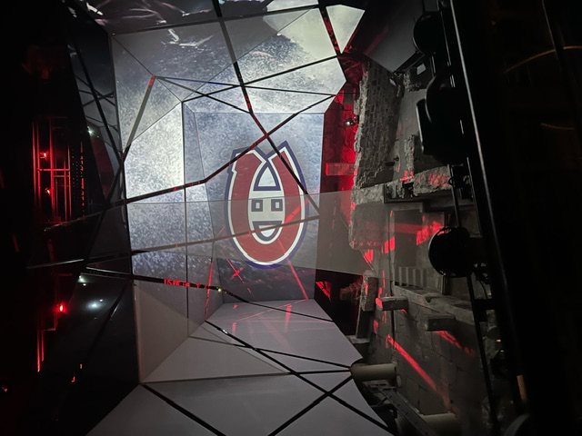
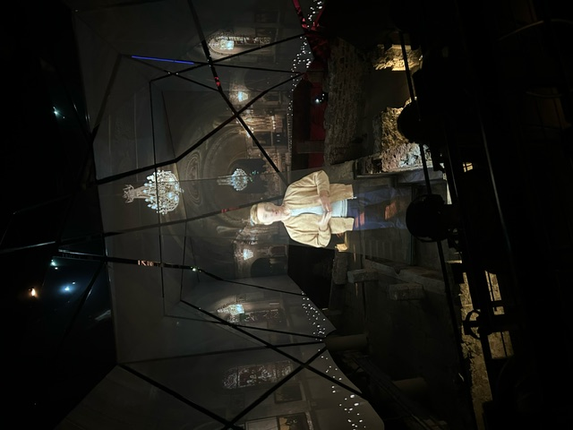
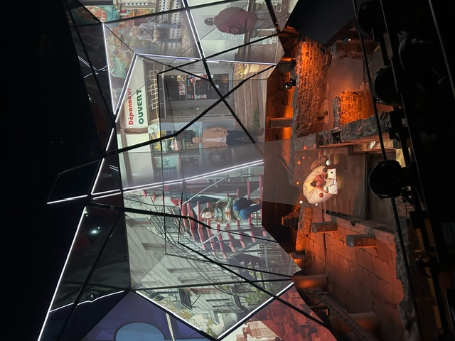
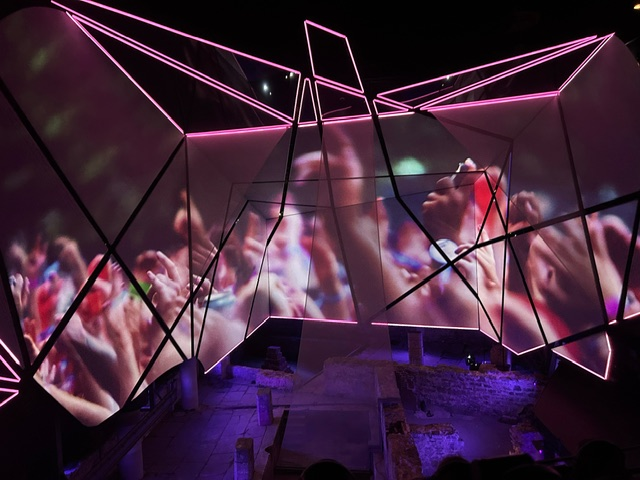
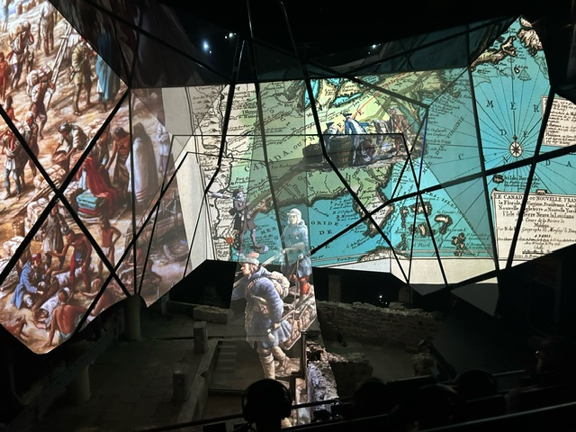

# génération MTL #
### Musée pointe-à-callière ###

Voici mon expérience à l'exposition ***génération MTL***.

# expérience proposer #
L'expérience proposer au musée était très mémorable. 
et les autre expérience dans le musée était très intéraisente et éducative.
mais l'exposition ***génération MTL*** était particuliairement intéraisente.
elle montrait beaucoup d'aspect du multimedia avec toute c'est écran triangulaire et c'est nombreuse effet de lumière.

 
---
# le but de l'exposition # 
 
l'exposition ***génération MTL*** parlait de l'histoire de montréal et des différente génération ou habitant qui on vécu a montreal.
une exposition qui ma beaucoup fait penser a mais cour d'histoire au secondaire 

cette exposition a parler de l'époque des autochtone et les ou l'histoire de la révolution industriel et les différente culture et peuple qui on vécu dans les rue de motréal.
que ça soit la culture sprotive ou les petit marchand des rue de montréal. ***génération MTL*** parle de toute les petit détail de la ville et des nobreux peuple qui on décider d'habiter les rue de cette merveilleuse ville.

