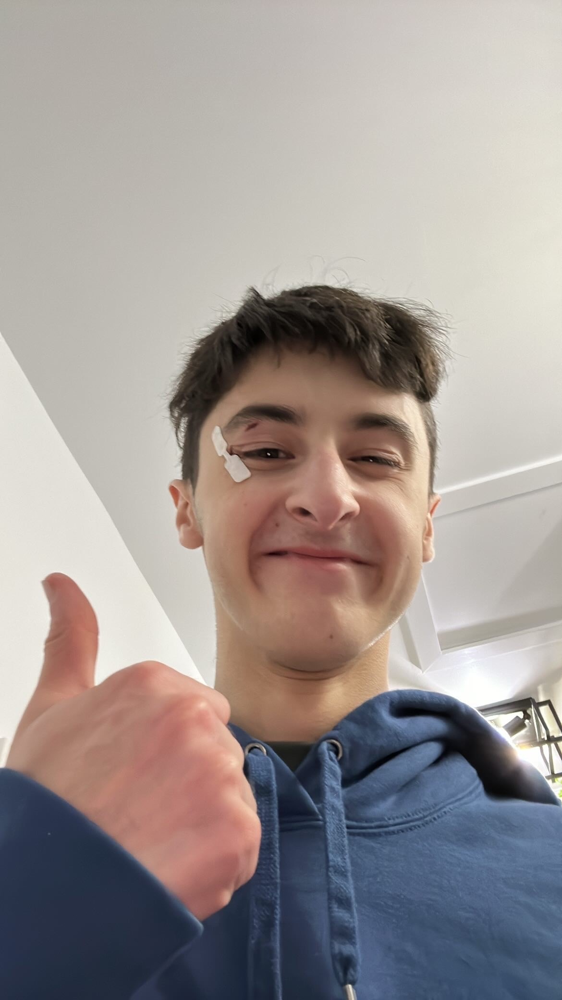

# Thomas Roussel

photo de qui a gagner mon match de mini hockey 

## **Intérêts dans le multimedia**
jaime le fait qu'on touche un peu a tout les aspait de la technologie et qu'on est pas juste former a faire juste un seul chose, je trouve que notre programme change beaucoup des autre programe et c'est vraiment cool de voir se genre de diversité. je suis une personne très artistique et se programme me donne l'opportunité de m'exprimé de façon libre et de me faire des ami qui ont a peux près les même intéret que moi. 
programme d'introduit a pleinde 

## Ce qui me plait dans l'introduction à la muséologie en TIM
le fait de voir des exposition  qu'on verrait pas nécéssairement si on était tout seul ou si ont avait jamais eux le cour se qui rend se cour différent des autre et qui nous permait de sortir en ville avec des ami et expérencer des expérience que tu ferait jamais dans un cour normal. 

